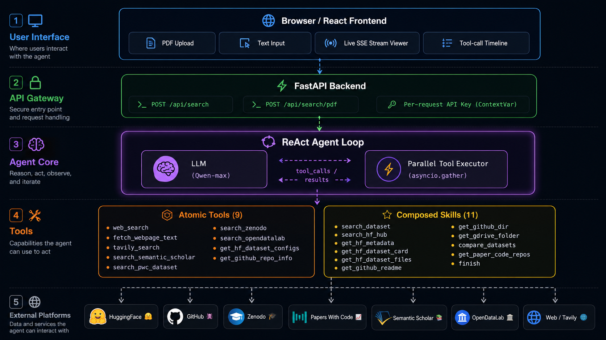

<div align="center">

<h1>🔍 Dataset Agent</h1>

<p><strong>Paper-driven dataset discovery, powered by a fully autonomous ReAct LLM agent.</strong><br/>
Drop in a paper PDF or paste an abstract — get structured dataset links across 7+ platforms in seconds.</p>

[](https://www.python.org/)
[](https://fastapi.tiangolo.com/)
[](https://react.dev/)
[](LICENSE)
[](CONTRIBUTING.md)

</div>

---

## What is Dataset Agent?

**Dataset Agent** is an agentic system that reads academic papers and automatically locates every dataset they reference — complete with download links, split statistics, license info, and more.

Unlike simple keyword scrapers, Dataset Agent runs a **ReAct (Reason + Act) loop**: the LLM autonomously decides which tools to call, inspects results, cross-verifies sources, and iterates until it is confident — just like a human research assistant would.

```
You: "Find all datasets used in this NeurIPS paper"  [paste PDF or abstract]

Agent: → Reads paper structure, extracts dataset mentions
       → Rewrites queries, searches HuggingFace + GitHub + Zenodo + PWC in parallel
       → Cross-verifies split counts, file sizes, and official repos
       → Returns structured report with verified download links
```

---

## ✨ Features

| | Feature | Details |
|---|---|---|
| 🤖 | **Autonomous ReAct Agent** | LLM drives the entire loop — no fixed pipelines |
| ⚡ | **Parallel Tool Execution** | Multiple tool calls in one LLM turn run concurrently via `asyncio.gather` |
| 📄 | **PDF Upload** | Upload a paper PDF directly; agent extracts title, abstract, dataset sections, arXiv links |
| 🌊 | **Real-time Streaming** | Server-Sent Events (SSE) stream every thought, tool call, and result to the UI instantly |
| 🔑 | **Per-request API Keys** | Keys are stored in the browser and sent per-request — nothing is persisted server-side |
| 🧠 | **Query Rewriting** | Automatically expands abbreviations (e.g. `DDGPrompt` → full dataset name) for better recall |
| ✅ | **Cross-verification** | Confirms split counts, file sizes, and official repos match the paper's description |
| 📚 | **Built-in Knowledge Base** | Local dataset KB for instant high-confidence hits on well-known datasets |
| 🔄 | **Tiered Retry** | 429 → wait + retry; 5xx/timeout → exponential backoff; 401/403 → immediate error |

---

## 🗂️ Supported Sources

| Platform | What is searched |
|---|---|
| 🤗 **HuggingFace Hub** | Dataset cards, splits, configs, file listings, gated access |
| 📈 **Papers With Code** | Benchmark datasets, leaderboard links |
| 🐙 **GitHub** | Official code repos, README links, data directories |
| 🎓 **Zenodo** | Academic open-access dataset archives |
| 📚 **Semantic Scholar** | Paper lookup for repo discovery |
| 🏛️ **OpenDataLab** | CV / Chinese NLP / autonomous driving datasets |
| 🌐 **Web Search** | DuckDuckGo + Tavily for long-tail datasets |

---

## 🏗️ Architecture

<div align="center">
  
</div>

---

## 🚀 Quick Start

### Prerequisites

- Python 3.11+
- Node.js 18+
- A [DashScope](https://dashscope.aliyuncs.com/) API key (OpenAI-compatible endpoint)

### 1. Clone & set up backend

```bash
git clone https://github.com/Eternity5188/Dataset-agent.git
cd dataset-agent/backend

pip install -r requirements.txt
```

### 2. Set environment variables

```bash
# Required
export DASHSCOPE_API_KEY=sk-xxxx        # DashScope

# Optional — removes rate-limit restrictions
export GITHUB_TOKEN=ghp_xxxx            # GitHub API (60 → 5000 req/h)
export HF_TOKEN=hf_xxxx                 # HuggingFace (gated datasets)
export SEMANTIC_SCHOLAR_API_KEY=xxxx    # S2 paper search
export TAVILY_API_KEY=tvly-xxxx         # High-quality web search
```

> **Windows (PowerShell)**
> ```powershell
> $env:DASHSCOPE_API_KEY = "sk-xxxx"
> ```

### 3. Start the backend

```bash
uvicorn main:app --reload --port 8000
```

### 4. Start the frontend

```bash
cd ../frontend
npm install
npm run dev          # → http://localhost:5173
```

Open `http://localhost:5173`, enter your DashScope key in Settings, and start searching.

---

## ⚙️ Configuration

| Key | Env Variable | Required | Purpose |
|---|---|---|---|
| DashScope | `DASHSCOPE_API_KEY` | ✅ Yes | LLM inference |
| GitHub | `GITHUB_TOKEN` | Optional | 5000 req/h (vs 60 unauthenticated) |
| HuggingFace | `HF_TOKEN` | Optional | Gated dataset access |
| Semantic Scholar | `SEMANTIC_SCHOLAR_API_KEY` | Optional | Paper search rate limit |
| Tavily | `TAVILY_API_KEY` | Optional | High-quality web search |

---

## 📡 API Reference

| Method | Endpoint | Description |
|---|---|---|
| `POST` | `/api/search` | Stream agent over text/abstract input (SSE) |
| `POST` | `/api/search/pdf` | Stream agent over uploaded PDF (SSE) |
| `GET` | `/api/health` | Health check + configured-key status |
| `GET` | `/api/kb` | List all entries in the built-in dataset knowledge base |

### SSE Event Schema

Each event is a JSON object:

```jsonc
// Agent thinking / intermediate step
{ "type": "thought",    "content": "I should search HuggingFace first..." }

// Tool invocation
{ "type": "tool_call",  "tool": "search_hf_hub", "args": { "query": "ImageNet" } }

// Tool result
{ "type": "tool_result","tool": "search_hf_hub", "content": { ... } }

// Final answer
{ "type": "finish",     "datasets": [ { "name": "ImageNet", "links": [...] } ] }

// Error
{ "type": "error",      "message": "Rate limit exceeded" }
```

---

## 🗂️ Project Structure

```
dataset-agent/
├── backend/
│   ├── main.py                 # FastAPI entry point, SSE streaming, CORS
│   ├── requirements.txt
│   └── agent/
│       ├── config.py           # Per-request API key ContextVar management
│       ├── loop.py             # ReAct agent loop (parallel tool exec, retry)
│       ├── pipeline.py         # PDF parsing + query building + loop adapter
│       ├── skills.py           # 11 composed skills + tool registry
│       ├── tools.py            # 9 atomic tool primitives
│       ├── searcher.py         # MultiSourceSearcher (HF / PWC / GitHub / Kaggle)
│       ├── reader.py           # Dataset page reader / link extractor
│       └── data/
│           └── dataset_kb.json # Built-in dataset knowledge base
└── frontend/
    ├── index.html
    ├── vite.config.js
    ├── package.json
    └── src/
        ├── main.jsx
        └── App.jsx             # Single-file React app with live SSE viewer
```

---

## 🤝 Contributing

Contributions are welcome! 

Please open an issue before submitting large changes.

---

## 📄 License

[MIT](LICENSE) © 2025

---

<div align="center">
  <sub>Built with FastAPI · React · LLMs · ❤️</sub>
</div>
